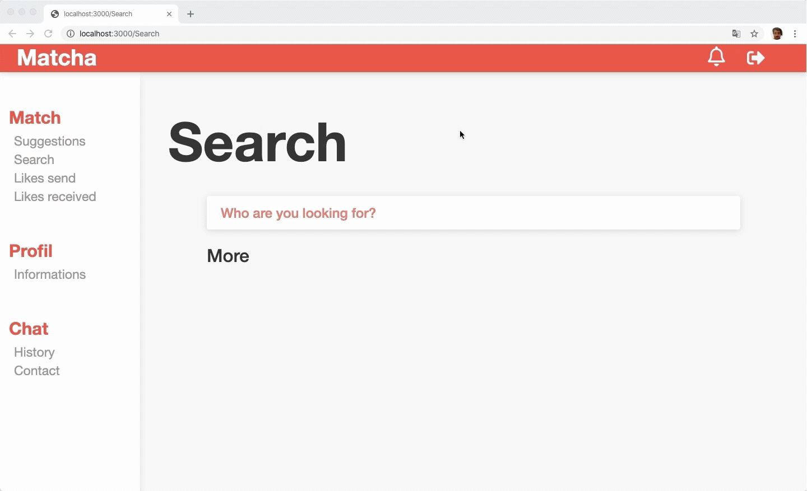
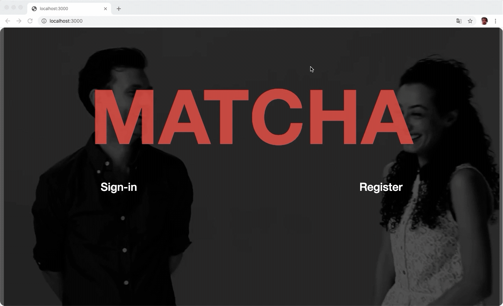
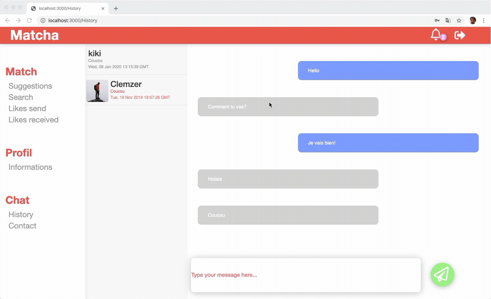

# MATCHA

2nd Web project for 42 school, Matcha is a dating site (made in React / Nodejs): 

This project was done with [Benjamin Tollie](https://github.com/BenjaminTle).

I did the front (UI/UX) of the project and Benjamin the back (using Neo4j)

## SUMMARY
- What is Matcha ?
- How to use it 
- Gallery

## What is Matcha ?

2nd project of the Web Branch of 42. Create a dating WebSite where the user can create his profile, search other users, like them and begin a conversation with a chat if the person liked him back. This website require node and neo4j.

### Features
- Inscription and connexion
- User profile
- User experience
- Research and filter users
- Real time chat
- Real time notification system


## How to use it ?
First launch Neo4j: `neo4j start` (_if you haven't installed neo4j run:_ `brew install neo4j`)

_If you haven't install npm run:_ `brew install node`

Finally in the main directory and the api folder run:
 ```
 npm i
 npm start
 ```

And you're good to go ;)

__Nb:__ Some features (like localisation) will not work unless you provide an google api key.

## Gallery







