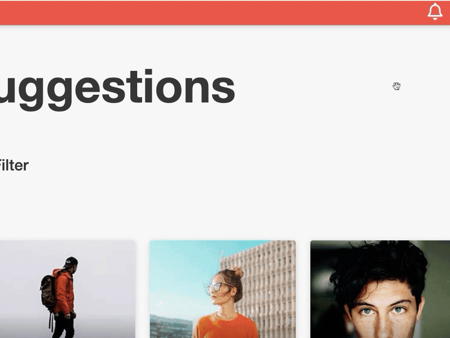

# MATCHA

2nd Web project of 42 school cursus, Matcha is a dating site made in React, Nodejs & Neo4j: 

This project was done with [Benjamin Tollie](https://github.com/BenjaminTle).

I was in charge of the front (UI/UX) and Benjamin of the back.

## SUMMARY
- What's Matcha ?
- Usage 
- Gallery

## What's Matcha ?
Interaction between users was the heart of this project: a user must be able to register, sign in, fill his/her profile, search and look into the profile of other users, like them, and chat with those that liked him/her back. No ORM, external validators or User Accounts Manager were allowed.

### Features
- Register and sign in
- Editing of user's profile
- Research and filter of other users
- Live chat with sockets
- Live notification system with sockets


## Usage
First, launch Neo4j: `neo4j start` (_if you haven't installed neo4j run:_ `brew install neo4j`)

_If you haven't install npm run:_ `brew install node`

Finally, at the root of the folder and in the api/ folder, run:
 ```
 npm i
 npm start
 ```

And you're good to go ;)

__Nb:__ Some features (like localisation) won't work unless you provide a google api key.

## Gallery

### Main Page


### Search Page


### Register Launch


### Bad input behvior


### Realtime Notification



### Chat


